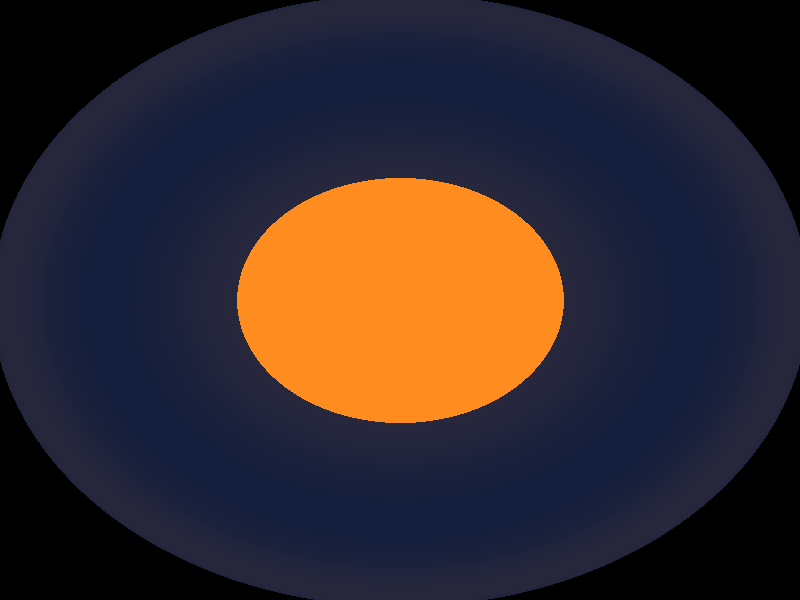
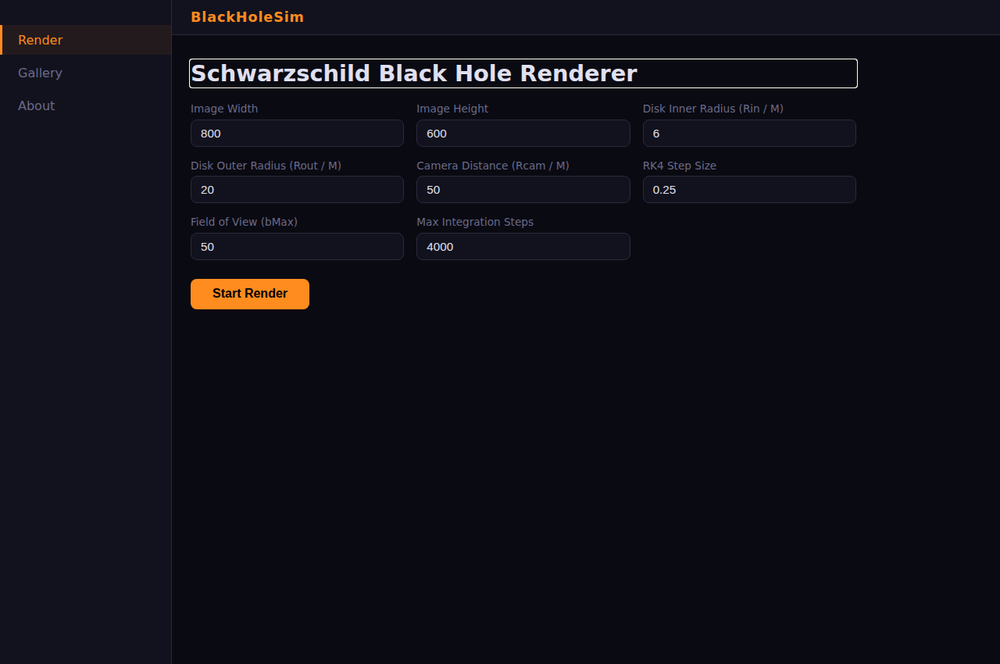
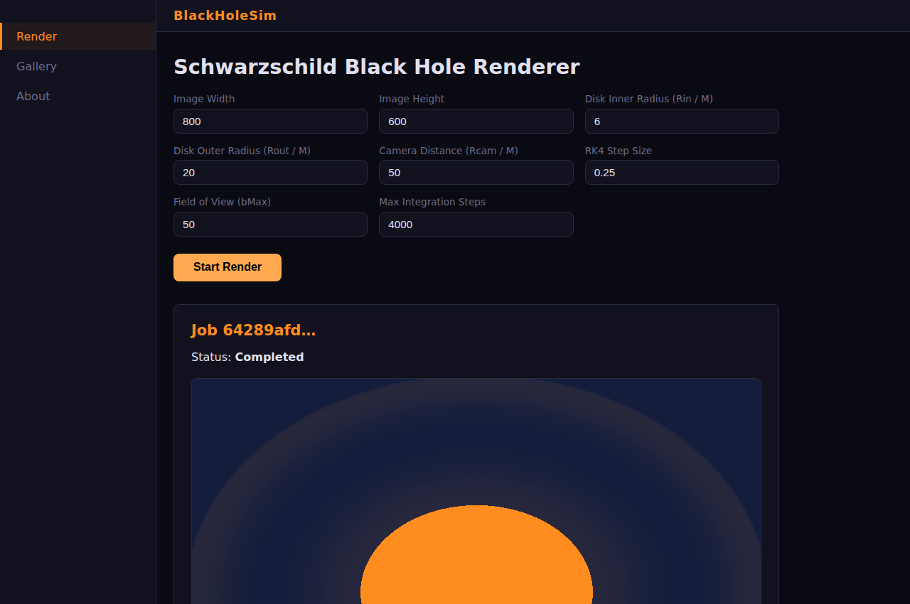
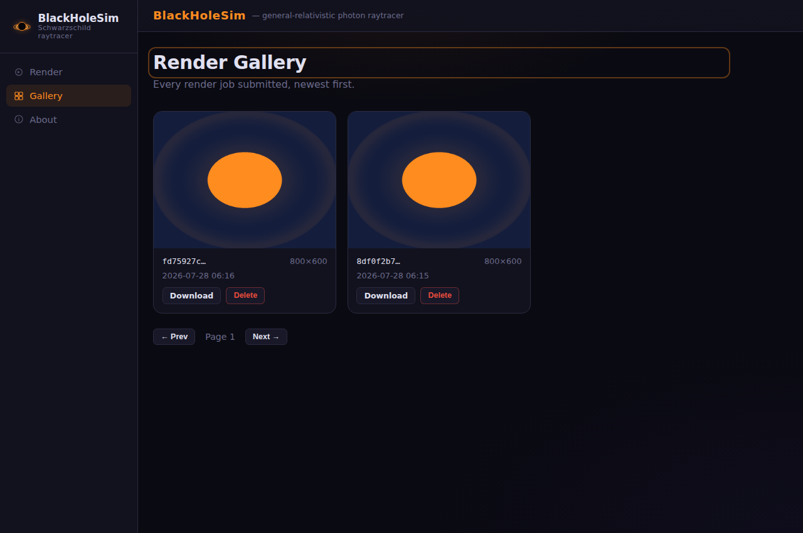
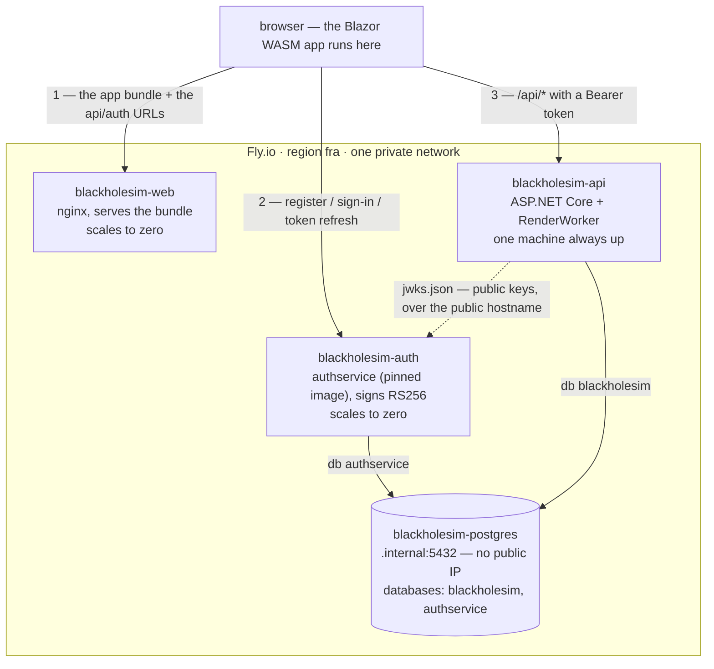
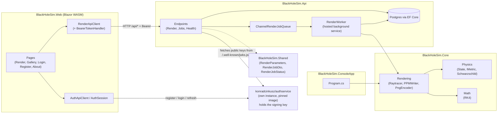
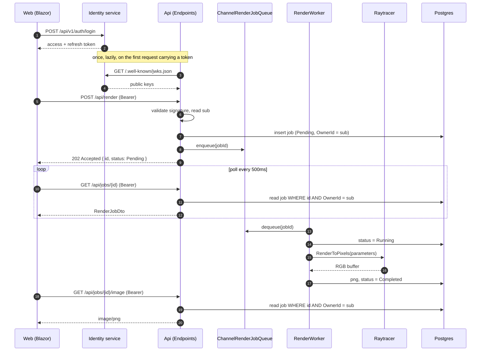

# BlackHoleSim

[](https://github.com/konradcinkusz/black-hole-sim/actions/workflows/flyio.yml)
[](LICENSE.txt)
[](https://dotnet.microsoft.com/download/dotnet/9.0)

**A Schwarzschild black hole raytracer, as a full-stack app.**

Photon geodesics in general relativity, numerically integrated in C#, rendered
into an image of a black hole with a thin accretion disk. What started as a
single console renderer is now four pieces: the physics/rendering core, a
one-shot console app, a REST API that runs renders as background jobs, and a
Blazor web UI on top of it — all sharing the same integrator, so the picture
you get from the CLI and the picture you get from the browser come from the
same code path.



```bash
git clone https://github.com/konradcinkusz/BlackHoleSim.git
cd BlackHoleSim
./scripts/setup.sh        # prerequisites, .env, a DB password and a token signing key
docker compose up --build
# web UI:   http://localhost:8080   ← create an account here first
# API:      http://localhost:5081/api
# identity: http://localhost:5083
```

Renders are private to the account that submitted them, so the first thing the web
UI asks for is a sign-in. Accounts live in this deployment's **own instance** of
[`konradcinkusz/authservice`](https://github.com/konradcinkusz/authservice), which
compose starts alongside everything else — see [Accounts and tokens](#accounts-and-tokens).

---

## Screenshots

The render form, a completed job, and the gallery — real screenshots of the
Blazor UI against a live API and Postgres, not mockups:

| Render form | Completed render |
|---|---|
|  |  |



---

## Simulations — the effect of field of view

Same black hole, same disk, only `BMax` (the maximum photon impact parameter
sampled) changes. Too narrow and every ray crosses the disk band before it
can escape or reach the horizon — no shadow, no sky, just flat disk colour;
too wide and the shadow and disk shrink to a speck in an empty frame:

| `BMax = 30` — no shadow, no sky | `BMax = 50` — default | `BMax = 80` — wide |
|---|---|---|
|  |  |  |

Reproduce any of these directly with the console renderer:
`dotnet run --project BlackHoleSim.ConsoleApp -- out.ppm 640 480 <bMax>`

---

## Projects

| Project | Role | Depends on |
|---|---|---|
| `BlackHoleSim.Core` | Physics (Schwarzschild metric, RK4 integrator), the raytracer, PPM/PNG encoding | — |
| `BlackHoleSim.Shared` | DTOs shared by API and Web (`RenderParameters`, `RenderJobDto`, `RenderJobStatus`) | — |
| `BlackHoleSim.ServiceDefaults` | Shared kernel — OpenTelemetry, `/health` + `/alive`, service discovery, HTTP resilience. Plumbing only: no entities, no physics, nothing about black holes | — |
| `BlackHoleSim.ConsoleApp` | One-shot CLI renderer → `.ppm` file | Core |
| `BlackHoleSim.Api` | ASP.NET Core minimal API: submits render jobs to a channel-backed queue, a hosted `RenderWorker` processes them, Postgres (EF Core) persists job state + the finished PNG | Core, Shared |
| `BlackHoleSim.Web` | Blazor WebAssembly UI: render form with live progress polling, paginated gallery, delete | Shared |
| `BlackHoleSim.AppHost` | Aspire orchestration for local dev — one command starts Postgres + Api + Web, wired together | Api, Web |
| `BlackHoleSim.Tests` | xUnit: RK4 convergence, Hamiltonian conservation along a geodesic, raytracer smoke tests, direct horizon-capture tests, and the API's authorization boundary | Core, Shared, Api |

One thing in the running system is not in this table, on purpose: the identity
service. It is a pinned image of another repository, run as its own app with its own
database and its own signing key, and nothing here compiles against it.

## Deployment options

| Mode | Command | Needs |
|---|---|---|
| **Aspire (recommended for dev)** | `dotnet run --project BlackHoleSim.AppHost` | .NET 9 SDK + Docker (Postgres and the identity service run as containers Aspire manages for you) |
| Docker Compose | `docker compose up --build` | Docker only, no SDK |
| **Fly.io (deployed)** | push a `v*` tag | a Fly account; see below |
| From source, no orchestration | see below | .NET 9 SDK + a reachable Postgres |
| Console renderer only | `dotnet run --project BlackHoleSim.ConsoleApp` | .NET 9 SDK, nothing else |

### Aspire (recommended for local dev)

```bash
dotnet run --project BlackHoleSim.AppHost
```

Starts Postgres (containerized, named volume `blackholesim-pgdata`), the identity
service (fixed port `8081`), the API (fixed port `5080`), and the Web UI (fixed port
`5173`), wired together and waiting on each other in the right order. Opens the Aspire dashboard
(`http://localhost:15888`) showing logs, traces, and health for all three —
click through to the Web UI from there. F5 in an IDE on the AppHost project
does the same with debuggers attached to everything.

The traces are real, not just forwarded console output: `BlackHoleSim.Api` calls
`AddServiceDefaults()` from `BlackHoleSim.ServiceDefaults`, which instruments
ASP.NET Core, `HttpClient` and the runtime with OpenTelemetry and exports over
OTLP to whatever `OTEL_EXPORTER_OTLP_ENDPOINT` names — the AppHost sets that to
the dashboard for you. Health probes are filtered out of traces, or they would
be nearly every span. Set no endpoint and the exporter is not registered at all,
so a bare `dotnet run` neither exports nor retries against a collector that
isn't there.

The API and Web ports are pinned (not Aspire's usual random-port allocation)
because the Blazor WebAssembly client can't do Aspire service discovery — it
runs in the browser, not in an orchestrated process — so both sides need to
agree on a port ahead of time. That's also why the Api's dev CORS policy
already allowlists exactly `5080`/`5173`.

### Docker Compose (API + Web + Postgres, no SDK)

```bash
./scripts/setup.sh        # or: cp .env.example .env
docker compose up --build
```

This starts four containers (`docker-compose.yml`): `db` (Postgres 16),
`auth` (the identity service, published on `${AUTH_PORT:-5083}`), `api`
(ASP.NET Core, published on `${API_PORT:-5081}`), and `web` (the Blazor
WASM app served by nginx on `${WEB_PORT:-8080}`). Open
`http://localhost:${WEB_PORT:-8080}`, create an account, submit a render from the
form, and watch it go `Pending → Running → Completed` with a live progress bar;
finished renders land in your gallery.

`auth` and `db` share a container but not a database: the identity service owns its
own logical database, which it creates on first start, with no cross-grants to this
stack's. A second always-on Postgres purely to hold one more database would be a cost
decision, not an architectural one.

The browser calls the API directly rather than through an nginx proxy. nginx
used to reverse-proxy `/api/*` to the `api` container, which made the two a
single origin locally — but that trick does not survive deployment, where each
service is its own app with its own hostname and there is no `api` to resolve.
The API address is written into `wwwroot/appsettings.json` when the web
container starts (from `API_BASE_URL`), so the same image runs unchanged
locally and deployed, and the API allows the frontend's origin explicitly
through `Cors__AllowedOrigins__0`.

Migrations run in a background service *after* the API starts listening, and
retry while Postgres is still coming up. `/health` stays red until they have
been applied — which is what `web`'s `depends_on: service_healthy` waits for.

### Fly.io — the deployed environment

Four apps, one per service: `blackholesim-web` (the bundle, scales to zero),
`blackholesim-auth` (the identity service, also scales to zero — nothing there runs
between requests), `blackholesim-api` (one machine always up, so a background render
is not stopped mid-flight), and `blackholesim-postgres` (private network only, no
public IP).

The web app serves the bundle and is then out of the loop — the numbered calls all
originate in the *browser*, cross-origin. Server-side there are exactly three edges:



The dashed arrow is the one to read twice: the API fetches the identity service's
*public* keys over `https://blackholesim-auth.fly.dev`, not `.internal` — auth
scales to zero, and only a request arriving through the Fly proxy can wake a
stopped machine. Edge-by-edge reasoning lives in
[`flyio/INFRASTRUCTURE-ANALYSIS.md`](flyio/INFRASTRUCTURE-ANALYSIS.md).

Deploying is pushing a tag:

```bash
git tag v1.0.0 && git push origin v1.0.0
```

`.github/workflows/flyio.yml` then tests, works out what changed since the
*previous tag*, builds each changed image exactly once, and deploys
postgres → auth → api → web. The identity service is deployed rather than built:
its `[build]` block names a pinned upstream image, so it is absent from the build
matrix by design. A service whose Fly app does not exist is always treated
as changed, so the first tag against an empty Fly organisation provisions
everything — no `fly launch`, no app or volume created by hand.

One-time human setup, and nothing more: create a GitHub environment named `fly`
holding `FLY_API_TOKEN`, `POSTGRES_PASSWORD` and `JWT_SIGNING_KEY`. All three are described in
[`flyio/SECRETS.md`](flyio/SECRETS.md); sizing and cost reasoning are in
[`flyio/INFRASTRUCTURE-ANALYSIS.md`](flyio/INFRASTRUCTURE-ANALYSIS.md).

The deploy checks one thing the platform health check cannot: that
`/.well-known/jwks.json` actually publishes a key. Configured without a keypair, the
identity service falls back to symmetric signing and serves a valid but *empty* key
set — the app is healthy, the deploy is green, and every token is then rejected by
the API. A green deploy should not be able to mean that.

Scaling and teardown are the **Fly.io scale** and **Fly.io destroy** workflows in
the Actions tab. Destroy needs a typed confirmation and keeps the data volume
unless you say otherwise; after one, a single tag brings everything back. Accounts
live on the Postgres volume, so keeping it keeps them.

### From source, no orchestration

Requires the [.NET 9 SDK](https://dotnet.microsoft.com/download/dotnet/9.0),
a reachable Postgres (`docker compose up db`, or any Postgres 16 you already have,
pointed at via `ConnectionStrings:Default`), and a reachable identity service
(`docker compose up auth`, or Aspire, which starts one on `:8081`).

```bash
dotnet restore BlackHoleSim.sln
dotnet build BlackHoleSim.sln -c Release

dotnet run --project BlackHoleSim.Api    # binds :5080 (Properties/launchSettings.json)
dotnet run --project BlackHoleSim.Web    # binds :5173, in a second terminal
```

The API refuses to start without `Auth:Authority`, naming the setting. There is no
"authentication off" mode to fall back to: a second code path in which every render is
world-readable is the posture this exists to remove, and a misconfigured deployment
silently taking it would be worse than not booting. The checked-in
`appsettings.Development.json` points at `http://localhost:8081`, which is where both
Aspire and `docker compose up auth` put it.

### Just the renderer (no API, no Docker, no database)

```bash
dotnet run --project BlackHoleSim.ConsoleApp
```

Produces `blackhole.ppm` (800×600, `bMax=50`) in the current directory.
Convert it with ImageMagick if you want a PNG/JPG:

```bash
magick blackhole.ppm blackhole.png
```

Optional positional args override the defaults:
`dotnet run --project BlackHoleSim.ConsoleApp -- out.ppm <width> <height> <bMax>`.

### Tests

```bash
dotnet test BlackHoleSim.sln -c Release
```

---

## Accounts and tokens

Renders are private to the account that submitted them. Before this, the API accepted
anything: every endpoint was anonymous, and the gallery was one global namespace where
any caller could list, download and delete every render anyone had submitted. A GUID is
hard to guess, but `GET /api/jobs` handed them out twenty at a time.

### Who does what

```
browser ──1── register / sign in ──→  blackholesim-auth   (issues tokens; holds the private key)
   │                                        │
   │                                        └── publishes /.well-known/jwks.json
   │                                                         │
   └──2── Authorization: Bearer … ──→  blackholesim-api ─────┘  (verifies; holds no key)
```

1. The frontend talks to the identity service directly for registration, sign-in and
   token refresh. It never proxies through the API.
2. It attaches the access token to every call to the API, which validates the signature
   against the identity service's published public keys and reads the caller's `sub`.
   No call back to the identity service happens on the request path.

**This service cannot mint a token.** It fetches public keys from a JWKS and holds no
key material at all — the only auth setting a deployment supplies is an address. That is
what the identity service signing with RS256 rather than a shared secret buys: under
HS256, verifying and signing are the same capability, so handing this API the key to
check tokens would also hand it the ability to forge one for any account
([authservice ADR 0002](https://github.com/konradcinkusz/authservice/blob/main/docs/decisions/0002-token-signing-algorithm.md)).

### Its own instance, not a shared one

Each project that uses `authservice` runs its **own** deployment of it — own machine, own
database, own independently generated signing key. Nothing is shared between two consumers
at runtime except the image that produced both, so a compromised key or a bad migration in
one cannot reach another. This repository takes no source-level dependency on that one: it
references a pinned image tag and nothing else.

### What a job endpoint does now

Every job route filters on the caller's `sub`. Someone else's job answers **404, not 403** —
403 confirms the id names a real render, which is the enumeration answer the ownership
filter exists to withhold.

Rows written before this change have no owner. They are visible to nobody rather than to
everybody; backfilling them onto some sentinel account would hand one arbitrary user
everyone else's renders. To drop them:

```sql
DELETE FROM "RenderJobs" WHERE "OwnerId" IS NULL;
```

### Requirements on the identity service

`ghcr.io/konradcinkusz/authservice:v0.3.0` is published, and it is the first tag that
carries RS256 signing and the JWKS endpoint — `v0.2.0` and earlier predate that work and
sign with HS256 only. The pin needs no change: `docker compose up` pulls it as-is.

The pinned tag must be one that signs with **RS256 and publishes a JWKS**. An HS256-only
build serves a valid but empty key set, and the API then rejects every token it issues.
That is not a theoretical guard against some future tag — it is why moving this pin
backwards would break sign-in rather than merely regress features.
The image tag lives in `flyio/blackholesim-auth.fly.toml`, `docker-compose.yml`
(`AUTH_IMAGE_TAG`), and `BlackHoleSim.AppHost/Program.cs`.

Its `Jwt__Issuer` and `Jwt__Audience` must equal this API's `Auth__Issuer` and
`Auth__Audience` exactly — both are set to `BlackHoleSim` rather than the upstream
`AuthService` default, because two deployments left on the defaults would accept each
other's tokens.

## Configuration

| Setting | Where | Purpose |
|---|---|---|
| `POSTGRES_USER` / `POSTGRES_PASSWORD` / `POSTGRES_DB` | `.env` (see `.env.example`) | Postgres credentials used by both the `db` and `api` containers |
| `WEB_PORT` | `.env` | Host port the web container is published on (default `8080`) |
| `API_PORT` | `.env` | Host port the API is published on (default `5081`). The browser calls this directly, so it also feeds the API's CORS allowlist — `docker-compose.yml` wires both from this one variable. |
| `AUTH_PORT` | `.env` | Host port the identity service is published on (default `5083`). Published for the same reason: the browser signs in against it directly. |
| `AUTH_IMAGE_TAG` | `.env` | Which release of `konradcinkusz/authservice` to run. Pinned, never `latest` — a floating tag turns an unrelated upstream release into an unannounced deploy. |
| `AUTH_POSTGRES_DB` | `.env` | The identity service's own logical database on the shared Postgres instance. It creates the database itself on first start. |
| `API_BASE_URL` | container env (`docker-compose.yml`, `flyio/blackholesim-web.fly.toml`) | Where the frontend should call the API. Written into `wwwroot/appsettings.json` at container start, never baked into the bundle. |
| `Cors__AllowedOrigins__0` | container env | Origins the API accepts browser calls from. Overrides the built-in dev defaults (`5173`/`5080`). |
| `ConnectionStrings:Default` | `BlackHoleSim.Api/appsettings*.json` | Npgsql connection string. Overridden by Compose env vars in containers; injected by Aspire under this exact key when running via `BlackHoleSim.AppHost` (the Postgres database resource is deliberately named `Default` to match) |
| `ApiBaseUrl` | `BlackHoleSim.Web/wwwroot/appsettings*.json` | Where the WASM app points its `HttpClient`. `http://localhost:5080` in dev; in a container the file is **overwritten at start** from `API_BASE_URL`. Empty is treated the same as unset and falls back to the host's own origin. |
| `AuthBaseUrl` | `BlackHoleSim.Web/wwwroot/appsettings*.json` | Where the browser reaches the identity service, written at container start from `AUTH_BASE_URL`. Unlike `ApiBaseUrl` there is **no same-origin fallback** — the identity service is always its own app on its own hostname, and the bundle refuses to start rather than post credentials at itself. |
| `Auth:Authority` | `BlackHoleSim.Api/appsettings*.json`, container env | Base URL whose `/.well-known/openid-configuration` names the JWKS this API validates tokens against. **Required** — the API will not start without it. |
| `Auth:Issuer` / `Auth:Audience` | same | The `iss` and `aud` a token must carry. Must match the identity service's `Jwt__Issuer` / `Jwt__Audience`. |
| `Auth:RequireHttpsMetadata` | same | Defaults to `true`. Turned off only where the identity service is reached over a network that never leaves the platform — compose's service network, for instance. |
| `JWT_SIGNING_KEY` | GitHub environment `fly` → Fly secret `Jwt__PrivateKeyPem` | The RSA private key the identity service signs with. **Never** reaches this API; see [`flyio/SECRETS.md`](flyio/SECRETS.md). Locally the equivalent is `secrets/jwt-signing.pem`, generated by `./scripts/setup.sh` and gitignored. |

**One source of truth per variable.** Where the same value is defined in more
than one place, the authoritative one is: `.env` for local Compose runs,
`flyio/*.fly.toml` `[env]` for deployed non-secret config, and Fly secrets
(set by `.github/workflows/flyio.yml`) for anything secret. The checked-in
`appsettings*.json` values are fallbacks for a bare `dotnet run`, and are
overridden everywhere else.

Render parameters (`RenderParameters` in `BlackHoleSim.Shared`), settable per-job via the API/Web form or by editing defaults in code:

* `Rin`, `Rout` — accretion disk inner/outer radius (default 6M–20M; ISCO = 6M).
* `Rcam` — camera distance from the black hole (default 50M).
* `Step` — RK4 integration step size (smaller = more accurate, slower).
* `Width`, `Height` — output resolution (capped at 1920×1080 by the API).
* `BMax` — field-of-view scaling: the maximum impact parameter sampled (default 50). Too small and every ray crosses the disk band before it can escape or reach the horizon — the whole frame renders as flat disk colour with no shadow and no sky.
* `MaxSteps` — RK4 steps per ray before giving up (capped at 20,000 by the API).

## API

Every endpoint below except the health probes requires `Authorization: Bearer <token>`
and answers `401` without one. Each operates only on the calling account's own jobs.

| Endpoint | Description |
|---|---|
| `POST /api/render` | Submit a render job (`RenderParameters` body) → `202 Accepted` with a `RenderJobDto`. Filed under the caller. Rate-limited to 5/minute **per account** — it used to be one window shared by the whole deployment, so a single enthusiastic client starved every other. |
| `GET /api/jobs` | Paginated list of *your* jobs (`?page=&pageSize=`) |
| `GET /api/jobs/{id}` | Job status/progress. `404` for a job you do not own. |
| `GET /api/jobs/{id}/image` | Finished PNG (404 until `Completed`, and for a job you do not own) |
| `DELETE /api/jobs/{id}` | Cancel (if running) and delete one of your jobs |
| `GET /health` | **Readiness.** Every check: Postgres connectivity *and* whether migrations have been applied. Red (503) until the schema is usable, which is what a deploy waits on. |
| `GET /alive` | **Liveness.** Live-tagged checks only — "is this process running". A database outage must not be able to trigger a restart loop through it. |
| `GET /api/health`, `/api/health/db` | The pre-existing paths, kept so bookmarks and older compose files keep working. `/api/health` is `/health` under its old name. |

Jobs run on a hosted `RenderWorker` reading off an in-process channel queue
(`ChannelRenderJobQueue`); on API restart, any job left `Running` is reset to
`Pending` and re-enqueued so nothing is silently lost.

---

## 🧮 Theory (brief)

* Schwarzschild metric, equatorial plane (`G = c = 1`):

  $$
  ds^2 = -\left(1 - \frac{2M}{r}\right)dt^2
  + \frac{dr^2}{1 - 2M/r} + r^2 d\phi^2
  $$

* Photon motion from the null-geodesic Hamiltonian:

  $$
  H = \tfrac{1}{2} g^{\mu\nu} p_\mu p_\nu = 0
  $$

* Integrated with Runge–Kutta 4 (`BlackHoleSim.Core/Math/RK4.cs`).
* Event horizon at `r = 2M`; ISCO (inner disk edge) at `r = 6M`.
* The renderer is 2D (equatorial-plane geodesics only, no inclination), so
  the image is radially symmetric around the line of sight — a reasonable
  simplification for a face-on view, not a full 3D relativistic camera.
* The dark region in the render is true photon capture (`b` below the
  critical impact parameter `3√3·M ≈ 5.196M`), not an artifact of the finite
  camera distance — `Raytracer.Trace` used to paint both with the same
  colour; see `RaytracerSmokeTests.Trace_SmallImpactParameter_IsCapturedByHorizon`
  and `..._IsSkyNotShadow` for the two cases kept distinct.

## References

* Sean Carroll – *Spacetime and Geometry* (2003)
* J.-P. Luminet (1979) – *Image of a spherical black hole with thin accretion disk*
* Kavan's video: *Simulating Black Holes in C++* (YouTube)
* Kip Thorne – *Black Holes and Time Warps* (1994)

## Future work

* Kerr metric (rotating black holes).
* Gravitational redshift / Doppler beaming in the disk shading.
* A real inclined 3D camera instead of the current radially-symmetric 2D model.

## License

MIT — see [LICENSE.txt](LICENSE.txt).

---

## Design

### Component diagram



The one arrow worth reading twice is the last: it points *at* the identity service and
carries only public keys back. Nothing flows the other way, and no request from a browser
is ever relayed through it — the API verifies locally on every request.

### Sequence — submitting a render via the API



### Class diagram — physics core


