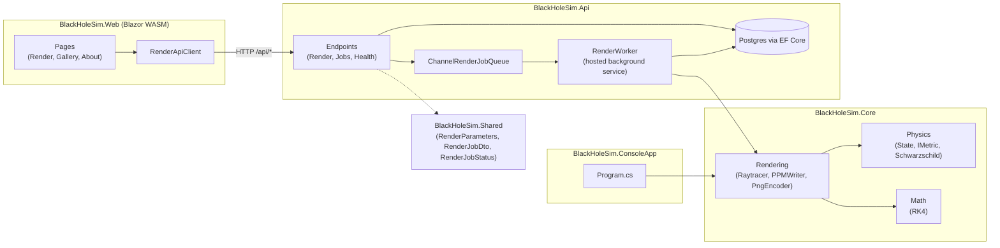
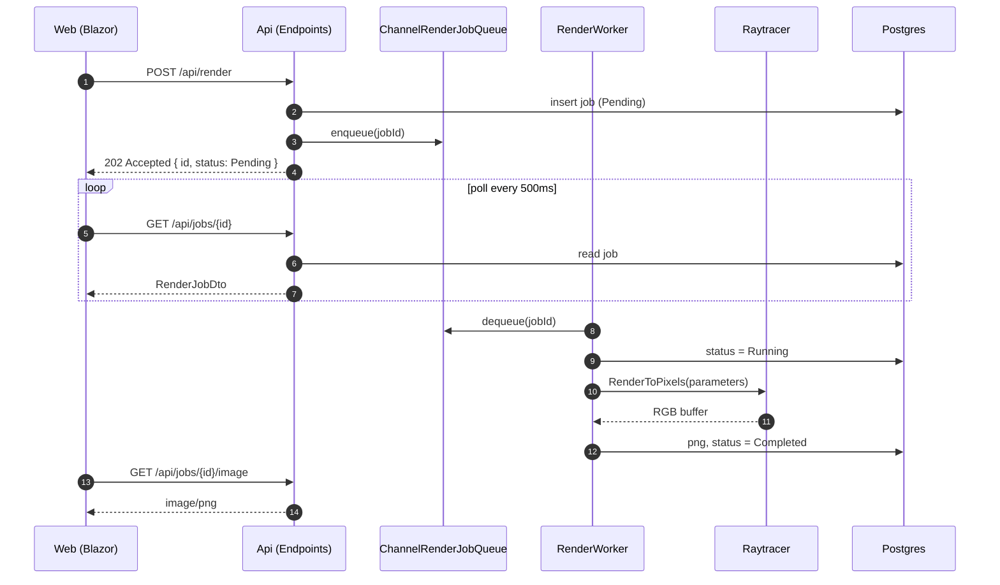
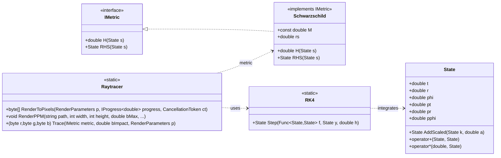

# BlackHoleSim

[](https://github.com/konradcinkusz/BlackHoleSim/actions/workflows/ci.yml)
[](LICENSE.txt)
[](https://dotnet.microsoft.com/download/dotnet/9.0)

**A Schwarzschild black hole raytracer, as a full-stack app.**

Photon geodesics in general relativity, numerically integrated in C#, rendered
into an image of a black hole with a thin accretion disk. What started as a
single console renderer is now four pieces: the physics/rendering core, a
one-shot console app, a REST API that runs renders as background jobs, and a
Blazor web UI on top of it — all sharing the same integrator, so the picture
you get from the CLI and the picture you get from the browser come from the
same code path.


```bash
git clone https://github.com/konradcinkusz/BlackHoleSim.git
cd BlackHoleSim
cp .env.example .env
docker compose up --build
# web UI:  http://localhost:8080
# API:     http://localhost:8080/api  (proxied by the web container's nginx)
```

---

## Screenshots

The render form, a completed job, and the gallery — real screenshots of the
Blazor UI against a live API and Postgres, not mockups:

| Render form | Completed render |
|---|---|
|  |  |


---

## Simulations — the effect of field of view

Same black hole, same disk, only `BMax` (the maximum photon impact parameter
sampled) changes. Too narrow and every ray crosses the disk band before it
can escape or reach the horizon — no shadow, no sky, just flat disk colour;
too wide and the shadow and disk shrink to a speck in an empty frame:

| `BMax = 30` — no shadow, no sky | `BMax = 50` — default | `BMax = 80` — wide |
|---|---|---|
|  |  |  |

Reproduce any of these directly with the console renderer:
`dotnet run --project BlackHoleSim.ConsoleApp -- out.ppm 640 480 <bMax>`

---

## Projects

| Project | Role | Depends on |
|---|---|---|
| `BlackHoleSim.Core` | Physics (Schwarzschild metric, RK4 integrator), the raytracer, PPM/PNG encoding | — |
| `BlackHoleSim.Shared` | DTOs shared by API and Web (`RenderParameters`, `RenderJobDto`, `RenderJobStatus`) | — |
| `BlackHoleSim.ConsoleApp` | One-shot CLI renderer → `.ppm` file | Core |
| `BlackHoleSim.Api` | ASP.NET Core minimal API: submits render jobs to a channel-backed queue, a hosted `RenderWorker` processes them, Postgres (EF Core) persists job state + the finished PNG | Core, Shared |
| `BlackHoleSim.Web` | Blazor WebAssembly UI: render form with live progress polling, paginated gallery, delete | Shared |
| `BlackHoleSim.AppHost` | Aspire orchestration for local dev — one command starts Postgres + Api + Web, wired together | Api, Web |
| `BlackHoleSim.Tests` | xUnit: RK4 convergence, Hamiltonian conservation along a geodesic, raytracer smoke tests, direct horizon-capture tests | Core, Shared |

## Deployment options

| Mode | Command | Needs |
|---|---|---|
| **Aspire (recommended for dev)** | `dotnet run --project BlackHoleSim.AppHost` | .NET 9 SDK + Docker (Postgres runs as a container Aspire manages for you) |
| Docker Compose | `docker compose up --build` | Docker only, no SDK |
| **GHCR (no clone)** | see below | Docker only — no clone, no SDK |
| From source, no orchestration | see below | .NET 9 SDK + a reachable Postgres |
| Console renderer only | `dotnet run --project BlackHoleSim.ConsoleApp` | .NET 9 SDK, nothing else |

### Aspire (recommended for local dev)

```bash
dotnet run --project BlackHoleSim.AppHost
```

Starts Postgres (containerized, named volume `blackholesim-pgdata`), the API
(fixed port `5080`), and the Web UI (fixed port `5173`), wired together and
waiting on each other in the right order. Opens the Aspire dashboard
(`http://localhost:15888`) showing logs, traces, and health for all three —
click through to the Web UI from there. F5 in an IDE on the AppHost project
does the same with debuggers attached to everything.

The API and Web ports are pinned (not Aspire's usual random-port allocation)
because the Blazor WebAssembly client can't do Aspire service discovery — it
runs in the browser, not in an orchestrated process — so both sides need to
agree on a port ahead of time. That's also why the Api's dev CORS policy
already allowlists exactly `5080`/`5173`.

### Docker Compose (API + Web + Postgres, no SDK)

```bash
cp .env.example .env      # adjust POSTGRES_* / WEB_PORT if needed
docker compose up --build
```

This starts three containers (`docker-compose.yml`): `db` (Postgres 16),
`api` (ASP.NET Core; migrations run on every startup, not just in
Development — see CHANGELOG), and `web` (the Blazor WASM app served by
nginx, which also proxies `/api/*` to the API container). Open
`http://localhost:${WEB_PORT:-8080}`, submit a render from the form, and
watch it go `Pending → Running → Completed` with a live progress bar;
finished renders land in the gallery.

### GHCR — no clone, just pull

```bash
curl -O https://raw.githubusercontent.com/konradcinkusz/BlackHoleSim/master/docker-compose.ghcr.yml
docker compose -f docker-compose.ghcr.yml up
# http://localhost:8080
```

Pulls the pre-built images from `.github/workflows/build-containers.yml`
(published on tagged releases) instead of building locally. No repository
checkout needed. **No release has been tagged yet**, so `latest` doesn't
exist until the first one is — until then, use Aspire or Docker Compose.

### From source, no orchestration

Requires the [.NET 9 SDK](https://dotnet.microsoft.com/download/dotnet/9.0)
and a reachable Postgres (`docker compose up db`, or any Postgres 16 you
already have, pointed at via `ConnectionStrings:Default`).

```bash
dotnet restore BlackHoleSim.sln
dotnet build BlackHoleSim.sln -c Release

dotnet run --project BlackHoleSim.Api    # binds :5080 (Properties/launchSettings.json)
dotnet run --project BlackHoleSim.Web    # binds :5173, in a second terminal
```

### Just the renderer (no API, no Docker, no database)

```bash
dotnet run --project BlackHoleSim.ConsoleApp
```

Produces `blackhole.ppm` (800×600, `bMax=50`) in the current directory.
Convert it with ImageMagick if you want a PNG/JPG:

```bash
magick blackhole.ppm blackhole.png
```

Optional positional args override the defaults:
`dotnet run --project BlackHoleSim.ConsoleApp -- out.ppm <width> <height> <bMax>`.

### Tests

```bash
dotnet test BlackHoleSim.sln -c Release
```

---

## Configuration

| Setting | Where | Purpose |
|---|---|---|
| `POSTGRES_USER` / `POSTGRES_PASSWORD` / `POSTGRES_DB` | `.env` (see `.env.example`) | Postgres credentials used by both the `db` and `api` containers |
| `WEB_PORT` | `.env` | Host port the web container is published on (default `8080`) |
| `ConnectionStrings:Default` | `BlackHoleSim.Api/appsettings*.json` | Npgsql connection string. Overridden by Compose/GHCR env vars in containers; injected by Aspire under this exact key when running via `BlackHoleSim.AppHost` (the Postgres database resource is deliberately named `Default` to match) |
| `ApiBaseUrl` | `BlackHoleSim.Web/wwwroot/appsettings*.json` | Where the WASM app points its `HttpClient`; empty in prod (nginx proxies same-origin — empty is treated the same as unset), `http://localhost:5080` in dev |

Render parameters (`RenderParameters` in `BlackHoleSim.Shared`), settable per-job via the API/Web form or by editing defaults in code:

* `Rin`, `Rout` — accretion disk inner/outer radius (default 6M–20M; ISCO = 6M).
* `Rcam` — camera distance from the black hole (default 50M).
* `Step` — RK4 integration step size (smaller = more accurate, slower).
* `Width`, `Height` — output resolution (capped at 1920×1080 by the API).
* `BMax` — field-of-view scaling: the maximum impact parameter sampled (default 50). Too small and every ray crosses the disk band before it can escape or reach the horizon — the whole frame renders as flat disk colour with no shadow and no sky.
* `MaxSteps` — RK4 steps per ray before giving up (capped at 20,000 by the API).

## API

| Endpoint | Description |
|---|---|
| `POST /api/render` | Submit a render job (`RenderParameters` body) → `202 Accepted` with a `RenderJobDto`. Rate-limited to 5/minute. |
| `GET /api/jobs` | Paginated job list (`?page=&pageSize=`) |
| `GET /api/jobs/{id}` | Job status/progress |
| `GET /api/jobs/{id}/image` | Finished PNG (404 until `Completed`) |
| `DELETE /api/jobs/{id}` | Cancel (if running) and delete a job |
| `GET /api/health`, `/api/health/db` | Health checks (incl. Postgres connectivity) |

Jobs run on a hosted `RenderWorker` reading off an in-process channel queue
(`ChannelRenderJobQueue`); on API restart, any job left `Running` is reset to
`Pending` and re-enqueued so nothing is silently lost.

---

## 🧮 Theory (brief)

* Schwarzschild metric, equatorial plane (`G = c = 1`):

  $$
  ds^2 = -\left(1 - \frac{2M}{r}\right)dt^2
  + \frac{dr^2}{1 - 2M/r} + r^2 d\phi^2
  $$

* Photon motion from the null-geodesic Hamiltonian:

  $$
  H = \tfrac{1}{2} g^{\mu\nu} p_\mu p_\nu = 0
  $$

* Integrated with Runge–Kutta 4 (`BlackHoleSim.Core/Math/RK4.cs`).
* Event horizon at `r = 2M`; ISCO (inner disk edge) at `r = 6M`.
* The renderer is 2D (equatorial-plane geodesics only, no inclination), so
  the image is radially symmetric around the line of sight — a reasonable
  simplification for a face-on view, not a full 3D relativistic camera.
* The dark region in the render is true photon capture (`b` below the
  critical impact parameter `3√3·M ≈ 5.196M`), not an artifact of the finite
  camera distance — `Raytracer.Trace` used to paint both with the same
  colour; see `RaytracerSmokeTests.Trace_SmallImpactParameter_IsCapturedByHorizon`
  and `..._IsSkyNotShadow` for the two cases kept distinct.

## References

* Sean Carroll – *Spacetime and Geometry* (2003)
* J.-P. Luminet (1979) – *Image of a spherical black hole with thin accretion disk*
* Kavan's video: *Simulating Black Holes in C++* (YouTube)
* Kip Thorne – *Black Holes and Time Warps* (1994)

## Future work

* Kerr metric (rotating black holes).
* Gravitational redshift / Doppler beaming in the disk shading.
* A real inclined 3D camera instead of the current radially-symmetric 2D model.

## License

MIT — see [LICENSE.txt](LICENSE.txt).

---

## Design

### Component diagram



### Sequence — submitting a render via the API



### Class diagram — physics core


