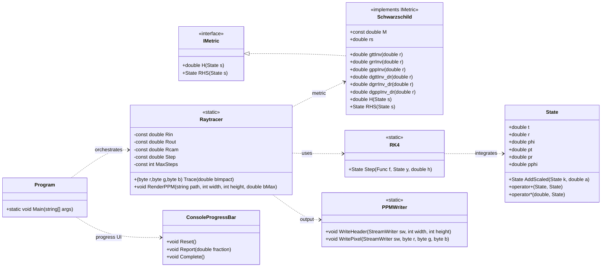
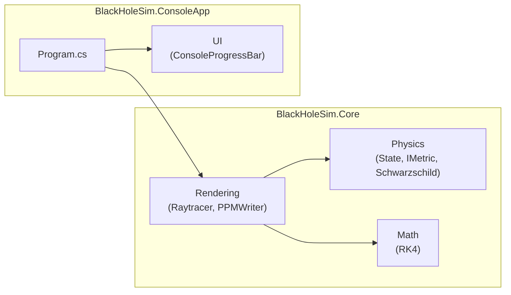
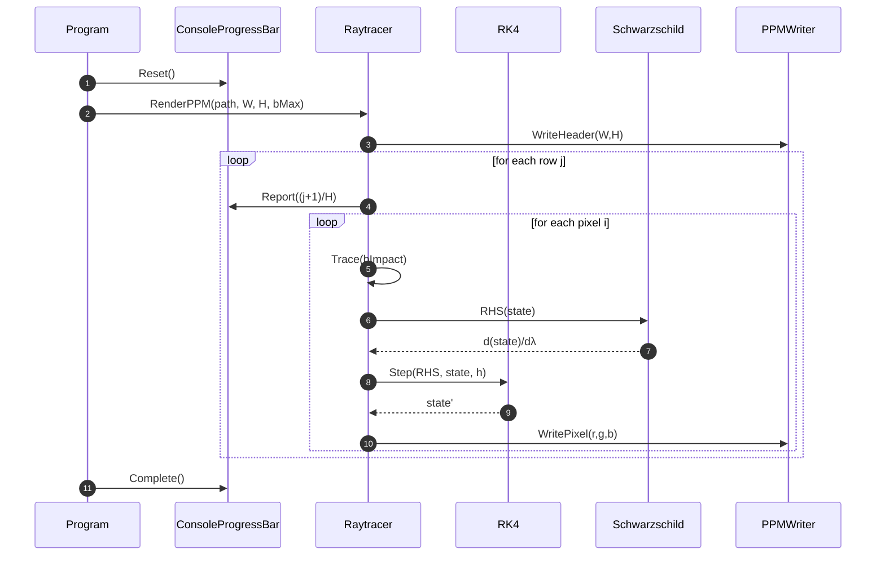

# CSharp FlashCards 2025

[](https://github.com/konradcinkusz/csharp-flashcards/releases/latest/download/CSharp_FlashCards.pdf)
[](https://github.com/konradcinkusz/csharp-flashcards/actions/workflows/ci.yml)
[](LICENSE.txt)

# BlackHoleSim

A C# implementation of a Schwarzschild black hole raytracer.
This project numerically integrates photon geodesics in general relativity and renders a synthetic 
image of a black hole with a thin accretion disk.

---

## ✨ Features
- Photon geodesics in Schwarzschild spacetime (`G = c = 1` units).
- Hamiltonian formulation of null geodesics with conserved energy and angular momentum.
- Runge–Kutta 4 integrator for stable numerical integration.
- Ray-marching renderer to generate images in `.ppm` format.
- Console progress bar for rendering feedback.
- Modular solution layout (core physics library + console app).

---

## 📂 Folder Structure

```

BlackHoleSim.sln
├─ BlackHoleSim.Core/                 # Core physics + rendering library
│  ├─ Physics/
│  │   ├─ State.cs
│  │   ├─ IMetric.cs
│  │   ├─ Schwarzschild.cs
│  │
│  ├─ Math/
│  │   └─ RK4.cs
│  │
│  ├─ Rendering/
│  │   ├─ Raytracer.cs
│  │   └─ PPMWriter.cs
│  │
│  └─ BlackHoleSim.Core.csproj
│
├─ BlackHoleSim.ConsoleApp/           # Console front-end
│  ├─ Program.cs
│  ├─ UI/
│  │   └─ ConsoleProgressBar.cs
│  │
│  └─ BlackHoleSim.ConsoleApp.csproj
│
└─ BlackHoleSim.sln

````

---

## 🚀 Getting Started

### Prerequisites
- [.NET 8 SDK](https://dotnet.microsoft.com/en-us/download) or newer  
- (Optional) [ImageMagick](https://imagemagick.org/) for converting `.ppm` output to `.png`

### Build
```bash
dotnet build
````

### Run

```bash
dotnet run --project BlackHoleSim.ConsoleApp
```

This produces an image file:

```
blackhole.ppm
```

Convert to PNG/JPG with ImageMagick:

```bash
magick blackhole.ppm blackhole.png
```

---

## ⚙ Configuration

You can adjust rendering parameters in `Raytracer.cs`:

* `Rin`, `Rout` → accretion disk inner/outer radius (default: 6–20M).
* `Rcam` → camera distance (default: 50M).
* `Step` → integration step size (smaller = more accurate, slower).
* `Width`, `Height` → image resolution.
* `bMax` → field of view scaling (impact parameter range).

---

## 🖼 Example Output

Example rendering of a Schwarzschild black hole with a thin orange disk:


---

## 🧮 Theory (Brief)

* We use the Schwarzschild metric (equatorial plane):

  $$
  ds^2 = -\left(1 - \frac{2M}{r}\right)dt^2
  + \frac{dr^2}{1 - 2M/r} + r^2 d\phi^2
  $$

* Photon motion is derived from the Hamiltonian:

  $$
  H = \tfrac{1}{2} g^{\mu\nu} p_\mu p_\nu = 0
  $$

* Integration is done via Runge–Kutta 4 (RK4).

* The event horizon is at \$r = 2M\$.

* The innermost stable circular orbit (ISCO) for the disk is at \$r = 6M\$.

---

## 📚 References

* Sean Carroll – *Spacetime and Geometry* (2003)
* J.-P. Luminet (1979) – *Image of a spherical black hole with thin accretion disk*
* Kavan’s video: *Simulating Black Holes in C++* (YouTube)
* Kip Thorne – *Black Holes and Time Warps* (1994)

---

## 🛠 Future Work

* Extend to Kerr metric (rotating black holes).
* More realistic disk shading (gravitational redshift, Doppler beaming).
* Parallelized rendering (`Parallel.For`).
* GUI front-end.

---

## 📜 License

This project is licensed under the MIT License.

---

## 📐 Designs

### Class Diagram



### Component / Package Diagram



### Sequence Diagram (Rendering)


